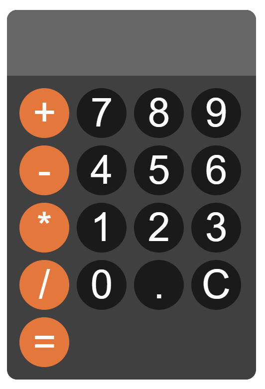

# Simple Calculator

This is a simple calculator project built with HTML, CSS, and JavaScript. It allows basic arithmetic operations such as addition, subtraction, multiplication, and division.

## Features

- Basic arithmetic operations: addition, subtraction, multiplication, division
- Clear display function
- Responsive design

## Project Structure

- `index.html`: The main HTML file containing the structure of the calculator.
- `style.css`: The CSS file for styling the calculator.
- `script.js`: The JavaScript file for handling the calculator's logic.

## Sample

## Usage

1. Clone the repository.
2. Open `index.html` in your web browser.
3. Use the calculator to perform basic arithmetic operations.

## License

This project is licensed under the MIT License.
